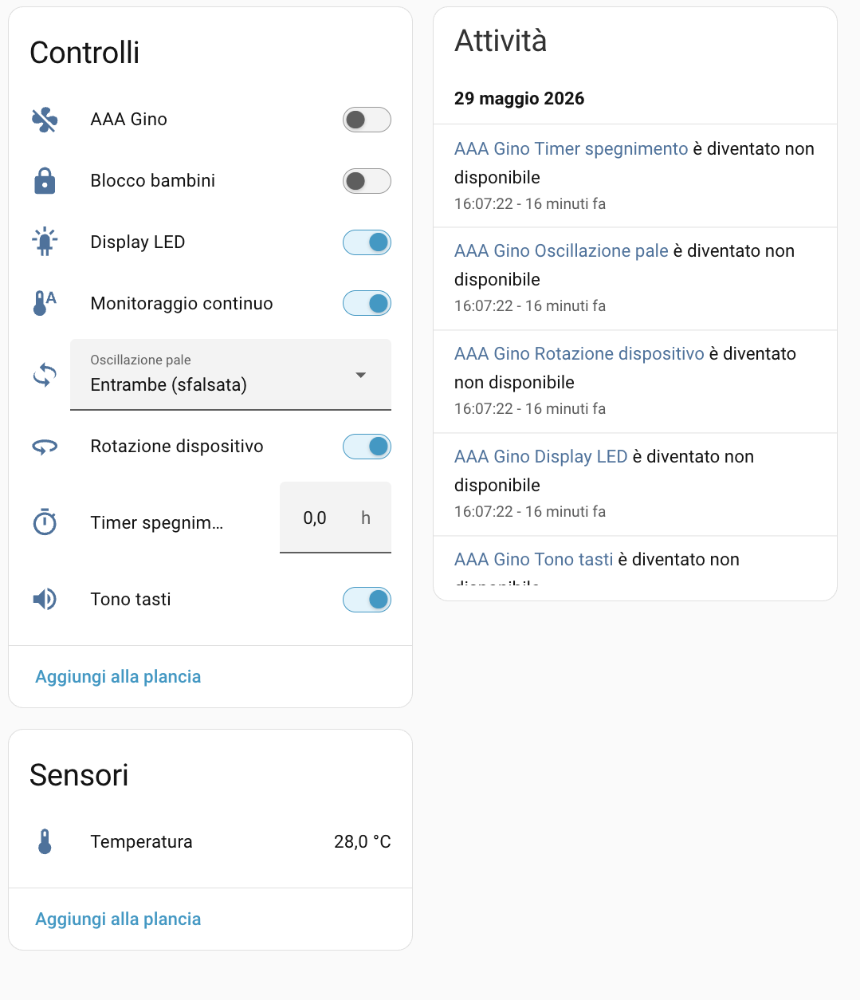

# Dreame Bladeless Fan MF10 — Home Assistant Integration

[![hacs][hacs-badge]][hacs]
[![Validate][validate-badge]][validate]
[![Release][release-badge]][releases]
[![License: MIT][license-badge]](LICENSE)
[![Stars][stars-badge]][repo]

Custom [Home Assistant](https://www.home-assistant.io/) integration for the **Dreame
Bladeless Fan MF10** (`dreame.fan.u2519`), controlled through the Dreamehome cloud.
Cloud-first — no local API assumed, just your Dreamehome account.

> **Full control from Home Assistant, including power on/off** — exposed as a native `fan`
> entity. See [On/off](#onoff) for the command details.

> ⭐ **Using this integration?** Leave a star — there's no telemetry, so a star is the only
> way to gauge how many people around the world rely on it and to help prioritize maintenance.

## Features

- 🌀 **Fan entity** — on/off, speed (1–10 as a percentage), and preset modes
  (AI · Powerful · Sleep · Manual · Natural)
- 🔁 **Blade oscillation** — 6 coherent states (off / left / right / both: independent ·
  synchronized · staggered)
- 🔄 **Device rotation** — the base swiveling on itself, as a switch
- 🌡️ **Ambient temperature** sensor
- 🔒 Switches for child lock, continuous monitoring (TempSync), key tone, LED display
- ⏲️ Auto-off timer
- ☁️ UI config flow, multi-region cloud login, 30 s polling with immediate refresh after each command

## Screenshots

<!-- Drop a screenshot at docs/images/dashboard.png to show it here. -->


## Supported devices

| Model ID            | Name                       |
|---------------------|----------------------------|
| `dreame.fan.u2519`  | Dreame Bladeless Fan MF10  |

The architecture is built around a model-capability map so other Dreame fans can be added
later, but only the MF10 is validated today.

## Installation

### HACS (custom repository)

1. HACS → ⋮ → **Custom repositories**.
2. Add `https://github.com/xmavgithub/dreame-mf10-integration` with category **Integration**.
3. Install **Dreame Bladeless Fan MF10**, then restart Home Assistant.

### Manual

1. Copy `custom_components/dreame_mf10/` into your config folder:
   `<config>/custom_components/dreame_mf10/`.
2. Restart Home Assistant.

## Configuration

**Settings → Devices & Services → Add Integration → Dreame MF10**, then enter your
Dreamehome **email**, **password**, and **region** (`eu`, `cn`, `us`, `sg`, `ru`).

The Dreame cloud is sharded by region (`https://{region}.iot.dreame.tech:13267`). If login
fails with `cannot_connect`, try a different region — accounts are sometimes routed
differently than expected.

## Entities

| Entity                                       | Domain   | Description                                                     |
|----------------------------------------------|----------|-----------------------------------------------------------------|
| `fan.dreame_mf10`                            | `fan`    | Main control: on/off, speed (%), preset modes                   |
| `sensor.dreame_mf10_temperature`             | `sensor` | Ambient temperature (°C, read-only)                             |
| `switch.dreame_mf10_child_lock`              | `switch` | Child lock                                                      |
| `switch.dreame_mf10_continuous_monitoring`   | `switch` | TempSync / continuous temperature monitoring                    |
| `switch.dreame_mf10_key_tone`                | `switch` | Button beep                                                     |
| `switch.dreame_mf10_display_led`             | `switch` | LED display always-on                                           |
| `switch.dreame_mf10_device_rotation`         | `switch` | Base rotation (the whole fan swiveling on itself)               |
| `select.dreame_mf10_oscillation`             | `select` | Blade oscillation (off / left / right / both …)                 |
| `number.dreame_mf10_off_timer`               | `number` | Auto-off timer (hours, 0 = disabled)                            |

> Fan speed is only honored by the device in **Manual** mode, so moving the speed slider
> automatically switches the fan to Manual.

## On/off

Power is performed via the MiOT action the Dreamehome app uses:

- **On**:  `action siid=2, aiid=1, in=[{piid:1, value:1}]`
- **Off**: `action siid=2, aiid=1, in=[{piid:1, value:0}]`

`siid=2, piid=1` is only the read-only state indicator (1 = on, 2 = standby).

> ⚠️ The **same** action with an empty input (`in=[]`) triggers a **WiFi reset** that requires
> physically re-pairing the device. The integration hardcodes the input argument, so that
> payload is unreachable in normal use.

## Limitations

- **Oscillation speed** (standard / fast) is not exposed by the cloud `get_properties` and is
  not yet controllable.
- **State updates are polled** (30 s) plus an immediate refresh after each HA command. The
  device also pushes state over MQTT; switching to real-time push is a planned follow-up.
- `async_step_reauth` is not implemented — if credentials expire, remove and re-add the
  integration.

## Security

- Passwords are MD5-salted before being sent (matching the Dreamehome app); they are not
  stored beyond the Home Assistant config-entry encryption.
- Access/refresh tokens live in memory only.
- Nothing sensitive (passwords, tokens, headers) is ever logged.

## For developers

Repository layout:

```text
custom_components/dreame_mf10/   # the integration
docs/                            # MiOT property map & technical reference
sandbox/                         # Docker-based HA instance for testing
dev/                             # development material (CLIs, notes)
```

The MiOT property map for `dreame.fan.u2519` is in
[docs/property_map.md](docs/property_map.md).

## Contributing

Contributions are welcome:

- **Bugs or requests** — open an [issue][issues] (bug/feature templates provided).
- **Another Dreame fan model?** The integration is built around a model-capability map. Capture
  your device's MiOT property map with the CLIs in `dev/tools/` and open an issue or PR with the
  results — more models can be supported.
- **Pull requests** — work in a feature branch and test against the Docker HA sandbox:
  `docker compose -f sandbox/docker-compose.yml up -d` (then http://localhost:8123).

If you use this integration, a ⭐ on the [repo][repo] is genuinely helpful — it's the only signal
of how many people rely on it.

## Credits

The Dreame Cloud auth and command flow is adapted from
[CodyJon/dreame-ap10-integration](https://github.com/CodyJon/dreame-ap10-integration)
(ported from sync `requests` to async `aiohttp`). The MF10 MiOT property map and power
command are specific to this model.

## License

[MIT](LICENSE) © 2026 Mauro Salvo

---

*Not affiliated with or endorsed by Dreame. "Dreame" and "Dreamehome" are trademarks of their
respective owners. Use at your own risk.*

[repo]: https://github.com/xmavgithub/dreame-mf10-integration
[issues]: https://github.com/xmavgithub/dreame-mf10-integration/issues
[stars-badge]: https://img.shields.io/github/stars/xmavgithub/dreame-mf10-integration?style=flat&logo=github
[hacs]: https://github.com/hacs/integration
[hacs-badge]: https://img.shields.io/badge/HACS-Custom-41BDF5.svg
[validate]: https://github.com/xmavgithub/dreame-mf10-integration/actions/workflows/validate.yml
[validate-badge]: https://github.com/xmavgithub/dreame-mf10-integration/actions/workflows/validate.yml/badge.svg
[releases]: https://github.com/xmavgithub/dreame-mf10-integration/releases
[release-badge]: https://img.shields.io/github/v/release/xmavgithub/dreame-mf10-integration?include_prereleases
[license-badge]: https://img.shields.io/badge/License-MIT-yellow.svg
